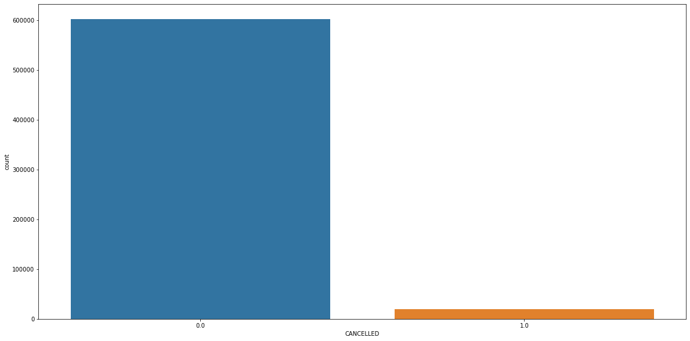

# Prediction of Flight Delay using Random Forests (Scikit Learn)
The data used in this project can be downloaded from https://www.transtats.bts.gov/Fields.asp


```python
import warnings
import numpy as np
import pandas as pd
import seaborn as sns
from sklearn import metrics
import matplotlib.pylab as plt
warnings.filterwarnings('ignore')
plt.rcParams["figure.figsize"] = (20,10)
df = pd.read_csv("Data_jan_2018.csv")
```

After inspecting the dataframe, I decided to remove the following columns because of missing values:

    - Unnamed: 37

    - SCH_OP_CARRIER
    
    - SCH_OP_UNIQUE_CARRIER 
    
    - SCH_OP_CARRIER_FL_NUM
    
    - SCH_OP_CARRIER_AIRLINE_ID 


```python
df.info()
df=df.drop(['SCH_OP_UNIQUE_CARRIER', 'SCH_OP_CARRIER_AIRLINE_ID','SCH_OP_CARRIER','SCH_OP_CARRIER_FL_NUM','Unnamed: 37'], axis=1)
```

    <class 'pandas.core.frame.DataFrame'>
    RangeIndex: 621461 entries, 0 to 621460
    Data columns (total 38 columns):
     #   Column                     Non-Null Count   Dtype  
    ---  ------                     --------------   -----  
     0   YEAR                       621461 non-null  int64  
     1   DAY_OF_WEEK                621461 non-null  int64  
     2   FL_DATE                    621461 non-null  object 
     3   MKT_UNIQUE_CARRIER         621461 non-null  object 
     4   BRANDED_CODE_SHARE         621461 non-null  object 
     5   MKT_CARRIER_AIRLINE_ID     621461 non-null  int64  
     6   MKT_CARRIER                621461 non-null  object 
     7   MKT_CARRIER_FL_NUM         621461 non-null  int64  
     8   SCH_OP_UNIQUE_CARRIER      160 non-null     object 
     9   SCH_OP_CARRIER_AIRLINE_ID  160 non-null     float64
     10  SCH_OP_CARRIER             160 non-null     object 
     11  SCH_OP_CARRIER_FL_NUM      160 non-null     float64
     12  OP_UNIQUE_CARRIER          621461 non-null  object 
     13  OP_CARRIER_AIRLINE_ID      621461 non-null  int64  
     14  OP_CARRIER                 621461 non-null  object 
     15  TAIL_NUM                   618702 non-null  object 
     16  OP_CARRIER_FL_NUM          621461 non-null  int64  
     17  ORIGIN                     621461 non-null  object 
     18  ORIGIN_CITY_NAME           621461 non-null  object 
     19  DEST                       621461 non-null  object 
     20  DEST_CITY_NAME             621461 non-null  object 
     21  DEP_DELAY                  602399 non-null  float64
     22  DEP_DELAY_NEW              602399 non-null  float64
     23  DEP_DEL15                  602399 non-null  float64
     24  DEP_DELAY_GROUP            602399 non-null  float64
     25  ARR_DELAY                  600857 non-null  float64
     26  ARR_DELAY_NEW              600857 non-null  float64
     27  ARR_DEL15                  600857 non-null  float64
     28  ARR_DELAY_GROUP            600857 non-null  float64
     29  CANCELLED                  621461 non-null  float64
     30  FLIGHTS                    621461 non-null  float64
     31  DISTANCE                   621461 non-null  float64
     32  CARRIER_DELAY              107792 non-null  float64
     33  WEATHER_DELAY              107792 non-null  float64
     34  NAS_DELAY                  107792 non-null  float64
     35  SECURITY_DELAY             107792 non-null  float64
     36  LATE_AIRCRAFT_DELAY        107792 non-null  float64
     37  Unnamed: 37                0 non-null       float64
    dtypes: float64(19), int64(6), object(13)
    memory usage: 180.2+ MB


We will inspect other categorical variables to decide if they are relevant. We notice that Flights and Cancelled have very poor distributions that are unlikely to be relevant.


```python
print(f'FLIGHTS Coulumn:\n{df["FLIGHTS"].value_counts()} \n')
print(f'CANCELLED Coulumn:\n{df["CANCELLED"].value_counts()} \n')
print(f'MKT_CARRIER Coulumn:\n{df["MKT_CARRIER"].value_counts()} \n')
print(f'BRANDED_CODE_SHARE Coulumn:\n{df["BRANDED_CODE_SHARE"].value_counts()} \n')
```

    FLIGHTS Coulumn:
    1.0    621461
    Name: FLIGHTS, dtype: int64 
    
    CANCELLED Coulumn:
    0.0    602485
    1.0     18976
    Name: CANCELLED, dtype: int64 
    
    MKT_CARRIER Coulumn:
    AA    163773
    DL    133374
    UA    116919
    WN    109676
    AS     28797
    B6     24871
    NK     14180
    F9      9707
    HA      7526
    G4      6814
    VX      5824
    Name: MKT_CARRIER, dtype: int64 
    
    BRANDED_CODE_SHARE Coulumn:
    WN              109676
    AA_CODESHARE     90175
    AA               73598
    UA_CODESHARE     71535
    DL               71254
    DL_CODESHARE     62120
    UA               45384
    B6               24871
    AS               15312
    NK               14180
    AS_CODESHARE     13485
    F9                9707
    G4                6814
    HA                6627
    VX                5824
    HA_CODESHARE       899
    Name: BRANDED_CODE_SHARE, dtype: int64 
    


## Cancelled flights make up about 3% of the dataset.


```python
CANCELLED_count = len(df[df['CANCELLED']==1])
pct_of_CANCELLED = CANCELLED_count/(len(df.CANCELLED))
print(f"Percentage of cancelled flights {pct_of_CANCELLED*100}%")
ax = sns.countplot(data = df, x = 'CANCELLED')
```

    Percentage of cancelled flights 3.053449854455871%





# we can see that some carriers are more prone to delays than others

By comparing the two following plots, The first representing flights that are 15 minutes or more late and the second showing on-time flights for each carrier.


```python
delayed_flights = df[df.ARR_DEL15 == 1]
ax = sns.countplot(data = delayed_flights, x = 'BRANDED_CODE_SHARE', order = delayed_flights['BRANDED_CODE_SHARE'].value_counts().index)
ticks = ax.set_xticklabels(ax.get_xticklabels(),rotation=45)
```


```python
nondelayed_flights = df[df.ARR_DEL15 == 0]
ax = sns.countplot(data = nondelayed_flights, x = 'BRANDED_CODE_SHARE', order = nondelayed_flights['BRANDED_CODE_SHARE'].value_counts().index)
ticks = ax.set_xticklabels(ax.get_xticklabels(),rotation=45)
```


## We will calculate the ratio of cancelled flights for each carrier


```python
df_delayed_flights = df[df.ARR_DEL15 == 1].groupby('BRANDED_CODE_SHARE').agg({'FLIGHTS':'count'}).reset_index()
df_delayed_flights.columns = ['Carrier', 'Delayed_Flights']
df_on_time_flights = df[df.ARR_DEL15 == 0].groupby('BRANDED_CODE_SHARE').agg({'FLIGHTS':'count'}).reset_index()
df_on_time_flights.columns = ['Carrier', 'On_Time_Flights']
df_delays = df_delayed_flights.merge(df_on_time_flights)
df_delays['Delayed_Flights_ratio'] = df_delays['Delayed_Flights']/(df_delays['Delayed_Flights'] + df_delays['On_Time_Flights'])
df_delays = df_delays.sort_values(by=['Delayed_Flights_ratio'], ascending=False)
sns.barplot(data=df_delays, x='Carrier', y = 'Delayed_Flights_ratio')
```


    <matplotlib.axes._subplots.AxesSubplot at 0x7f0b44227b90>


## Naturally, there's a very high correlation between arrival delays and departure delays. but we can't use departure delays as a feature because we won't have this information if we need to make a prediction about a future flight.


```python
sns.scatterplot(data=df, y="ARR_DELAY",x="DEP_DELAY",hue="BRANDED_CODE_SHARE")
```


    <matplotlib.axes._subplots.AxesSubplot at 0x7f0b441535d0>


## Below is the correlation matrix for all available features
Notice the correlation between DEP_DELAY, DEP_DELAY_NEW, DEP_DEL15, DEP_DELAY_GROUP, ARR_DELAY, ARR_DELAY_NEW, ARR_DEL15, and ARR_DELAY_GROUP


```python
corr=df.corr()
ax = sns.heatmap(corr, 
    vmin=-1, vmax=1, center=0,
    square=True)
ticks = ax.set_xticklabels(ax.get_xticklabels(), rotation=45, horizontalalignment='right')
```


## As discussed, departure delay features can be used. As are arrival delay features, only one of them can be the target feature
## The delay resons features CARRIER_DELAY, WEATHER_DELAY, NAS_DELAY, SECURITY_DELAY, and LATE_AIRCRAFT_DELAY can't be used because we have no way to tell that one of these reasons will occur in a future flight.
However it's possible to use weather reports when predicting future flight delay. We will engineer a new feature called WEATHER_GROUP which is a rating for the weather on a given day from 0 to 4, the higher the worse.
This is achieved by aggregating the mean WEATHER_DELAY by day accross all flights, calculating the .2, .4, .6, .8, 1 quantiles for these values and using these quantiles as cutoff values to determine the WEATHER_GROUP


```python
weather_df = df.groupby('FL_DATE').agg({'WEATHER_DELAY':'mean'}).reset_index()
weather_dict = {}
for weather_group, quantile in enumerate(np.arange(0.2, 1.01, .2)):
    weather_dict[weather_group] = np.quantile(weather_df.WEATHER_DELAY, quantile)
weather_dict
```


    {0: 1.6638576779026217,
     1: 2.4307098020280056,
     2: 4.502068252326784,
     3: 5.293251533742331,
     4: 16.381821197545197}


```python
weather_df['WEATHER_GROUP'] = 0
for index, row in weather_df.iterrows():
    for weather_group in range(0,5):
        if row['WEATHER_DELAY'] < weather_dict[weather_group]:
            weather_df.loc[index, 'WEATHER_GROUP'] = weather_group
            break
        if weather_group == 4:
            weather_df.loc[index, 'WEATHER_GROUP'] = 4

weather_df['WEATHER_GROUP'].value_counts()
```


    4    7
    3    6
    2    6
    1    6
    0    6
    Name: WEATHER_GROUP, dtype: int64


```python
weather_df = weather_df.drop(['WEATHER_DELAY'], axis=1)
df = df.merge(weather_df)
```

## We will remove all irrelevant categorical variables
Many of the categorical variables in this dataset are ids that are correlated with each other, we are going to keep the ones that give us the most variety and drop the rest


```python
print(f'MKT_CARRIER_FL_NUM unique values: {len(df.MKT_CARRIER_FL_NUM.unique())}\n\
OP_CARRIER_FL_NUM unique values: {len(df.OP_CARRIER_FL_NUM.unique())}')
```

    MKT_CARRIER_FL_NUM unique values: 6975
    OP_CARRIER_FL_NUM unique values: 6987


```python
columns_to_remove = [column for column in df.columns if ('ARR_DEL' in column or 'DEP_DEL' in column or 'DELAY' in column) and column != 'ARR_DELAY_GROUP' and column != 'ARR_DEL15']
columns_to_remove = columns_to_remove +['FLIGHTS','CANCELLED','MKT_CARRIER_FL_NUM','YEAR', 'FL_DATE', 'DEST_CITY_NAME', 'ORIGIN_CITY_NAME']
columns_to_remove
```


    ['DEP_DELAY',
     'DEP_DELAY_NEW',
     'DEP_DEL15',
     'DEP_DELAY_GROUP',
     'ARR_DELAY',
     'ARR_DELAY_NEW',
     'CARRIER_DELAY',
     'WEATHER_DELAY',
     'NAS_DELAY',
     'SECURITY_DELAY',
     'LATE_AIRCRAFT_DELAY',
     'FLIGHTS',
     'CANCELLED',
     'MKT_CARRIER_FL_NUM',
     'YEAR',
     'FL_DATE',
     'DEST_CITY_NAME',
     'ORIGIN_CITY_NAME']


## We will remove cancelled flights from our consideration because they don't fit our target.


```python
df = df[df.CANCELLED == 0]
df=df.drop(columns_to_remove, axis=1)
df.info()
```

    <class 'pandas.core.frame.DataFrame'>
    Int64Index: 602485 entries, 1 to 621460
    Data columns (total 16 columns):
     #   Column                  Non-Null Count   Dtype  
    ---  ------                  --------------   -----  
     0   DAY_OF_WEEK             602485 non-null  int64  
     1   MKT_UNIQUE_CARRIER      602485 non-null  object 
     2   BRANDED_CODE_SHARE      602485 non-null  object 
     3   MKT_CARRIER_AIRLINE_ID  602485 non-null  int64  
     4   MKT_CARRIER             602485 non-null  object 
     5   OP_UNIQUE_CARRIER       602485 non-null  object 
     6   OP_CARRIER_AIRLINE_ID   602485 non-null  int64  
     7   OP_CARRIER              602485 non-null  object 
     8   TAIL_NUM                602466 non-null  object 
     9   OP_CARRIER_FL_NUM       602485 non-null  int64  
     10  ORIGIN                  602485 non-null  object 
     11  DEST                    602485 non-null  object 
     12  ARR_DEL15               600857 non-null  float64
     13  ARR_DELAY_GROUP         600857 non-null  float64
     14  DISTANCE                602485 non-null  float64
     15  WEATHER_GROUP           602485 non-null  int64  
    dtypes: float64(3), int64(5), object(8)
    memory usage: 78.1+ MB


## We will drop all records that have nulls in the ARR_DEL15 column.


```python
df=df.dropna(subset=['ARR_DEL15'])
```

## This is How the correlation matrix look before we start encoding our features
We will have to decide which feature is going to become our target feature later on from ARR_DELAY_GROUP and ARR_DEL15, the other one will be dropped. 


```python
columns =  [column for column in df.columns if column != 'ARR_DELAY_GROUP' and column != 'ARR_DEL15'] + ['ARR_DELAY_GROUP', 'ARR_DEL15']
df = df[columns]
corr=df.corr()
ax = sns.heatmap(corr, 
    vmin=-1, vmax=1, center=0,
    square=True)
ticks = ax.set_xticklabels(ax.get_xticklabels(), rotation=45, horizontalalignment='right')
```


### The distribution of ARR_DELAY_GROUP


```python
sns.countplot(data = df, x='ARR_DELAY_GROUP')
```


    <matplotlib.axes._subplots.AxesSubplot at 0x7f0aa5db0310>


## We will encode all of the categorical features we are left with using ordinal encoding rather than one-hot encoding, because the labels are too many for that.
Since we are interested in delays we will treat early flights (ARR_DELAY_GROUP = -1 | ARR_DELAY_GROUP = -2) as on-time (ARR_DELAY_GROUP=0)


```python
import pandas as pd
from sklearn.preprocessing import LabelEncoder
le= LabelEncoder()
df['MKT_UNIQUE_CARRIER'] = le.fit_transform(df['MKT_UNIQUE_CARRIER'])
df['BRANDED_CODE_SHARE'] = le.fit_transform(df['BRANDED_CODE_SHARE'])
df['MKT_CARRIER_AIRLINE_ID'] = le.fit_transform(df['MKT_CARRIER_AIRLINE_ID'])
df['MKT_CARRIER'] = le.fit_transform(df['MKT_CARRIER'])
df['OP_CARRIER_FL_NUM'] = le.fit_transform(df['OP_CARRIER_FL_NUM'])
df['OP_UNIQUE_CARRIER'] = le.fit_transform(df['OP_UNIQUE_CARRIER'])
df['DEST'] = le.fit_transform(df['DEST'])
df['OP_CARRIER_AIRLINE_ID'] = le.fit_transform(df['OP_CARRIER_AIRLINE_ID'])
df['OP_CARRIER'] = le.fit_transform(df['OP_CARRIER'])
df['TAIL_NUM'] = le.fit_transform(df['TAIL_NUM'].astype(str))
df['ORIGIN'] = le.fit_transform(df['ORIGIN'])

df['ARR_DELAY_GROUP'] = df['ARR_DELAY_GROUP'].replace(-2,0)
df['ARR_DELAY_GROUP'] = df['ARR_DELAY_GROUP'].replace(-1,0)
df.head()
```


<div>
<style scoped>
    .dataframe tbody tr th:only-of-type {
        vertical-align: middle;
    }

    .dataframe tbody tr th {
        vertical-align: top;
    }

    .dataframe thead th {
        text-align: right;
    }
</style>
<table border="1" class="dataframe">
  <thead>
    <tr style="text-align: right;">
      <th></th>
      <th>DAY_OF_WEEK</th>
      <th>MKT_UNIQUE_CARRIER</th>
      <th>BRANDED_CODE_SHARE</th>
      <th>MKT_CARRIER_AIRLINE_ID</th>
      <th>MKT_CARRIER</th>
      <th>OP_UNIQUE_CARRIER</th>
      <th>OP_CARRIER_AIRLINE_ID</th>
      <th>OP_CARRIER</th>
      <th>TAIL_NUM</th>
      <th>OP_CARRIER_FL_NUM</th>
      <th>ORIGIN</th>
      <th>DEST</th>
      <th>DISTANCE</th>
      <th>WEATHER_GROUP</th>
      <th>ARR_DELAY_GROUP</th>
      <th>ARR_DEL15</th>
    </tr>
  </thead>
  <tbody>
    <tr>
      <th>1</th>
      <td>7</td>
      <td>3</td>
      <td>6</td>
      <td>2</td>
      <td>3</td>
      <td>0</td>
      <td>13</td>
      <td>0</td>
      <td>1255</td>
      <td>3462</td>
      <td>94</td>
      <td>254</td>
      <td>453.0</td>
      <td>2</td>
      <td>0.0</td>
      <td>0.0</td>
    </tr>
    <tr>
      <th>2</th>
      <td>7</td>
      <td>3</td>
      <td>6</td>
      <td>2</td>
      <td>3</td>
      <td>0</td>
      <td>13</td>
      <td>0</td>
      <td>1190</td>
      <td>3464</td>
      <td>42</td>
      <td>173</td>
      <td>187.0</td>
      <td>2</td>
      <td>0.0</td>
      <td>0.0</td>
    </tr>
    <tr>
      <th>3</th>
      <td>7</td>
      <td>3</td>
      <td>6</td>
      <td>2</td>
      <td>3</td>
      <td>0</td>
      <td>13</td>
      <td>0</td>
      <td>4662</td>
      <td>3467</td>
      <td>54</td>
      <td>173</td>
      <td>184.0</td>
      <td>2</td>
      <td>0.0</td>
      <td>0.0</td>
    </tr>
    <tr>
      <th>4</th>
      <td>7</td>
      <td>3</td>
      <td>6</td>
      <td>2</td>
      <td>3</td>
      <td>0</td>
      <td>13</td>
      <td>0</td>
      <td>1278</td>
      <td>3468</td>
      <td>260</td>
      <td>191</td>
      <td>335.0</td>
      <td>2</td>
      <td>0.0</td>
      <td>0.0</td>
    </tr>
    <tr>
      <th>5</th>
      <td>7</td>
      <td>3</td>
      <td>6</td>
      <td>2</td>
      <td>3</td>
      <td>0</td>
      <td>13</td>
      <td>0</td>
      <td>1278</td>
      <td>3469</td>
      <td>191</td>
      <td>226</td>
      <td>812.0</td>
      <td>2</td>
      <td>0.0</td>
      <td>0.0</td>
    </tr>
  </tbody>
</table>
</div>


## We still have three different features all indicating the carrier, we will keep the one that gives us the most variety.


```python
print(f'MKT_UNIQUE_CARRIER unique values: {len(df.MKT_UNIQUE_CARRIER.unique())}\n\
MKT_CARRIER unique values: {len(df.MKT_CARRIER.unique())}\n\
BRANDED_CODE_SHARE unique values: {len(df.BRANDED_CODE_SHARE.unique())}')
```

    MKT_UNIQUE_CARRIER unique values: 11
    MKT_CARRIER unique values: 11
    BRANDED_CODE_SHARE unique values: 16


```python
df = df.drop(['MKT_UNIQUE_CARRIER', 'MKT_CARRIER', 'OP_CARRIER_AIRLINE_ID'], axis=1)
```


```python
print(f'OP_UNIQUE_CARRIER unique values: {len(df.OP_UNIQUE_CARRIER.unique())}\n\
OP_CARRIER unique values: {len(df.OP_CARRIER.unique())}')
df = df.drop(['OP_UNIQUE_CARRIER'], axis=1)
```

    OP_UNIQUE_CARRIER unique values: 28
    OP_CARRIER unique values: 28


## Finally here're the features upon which our model will be built


```python
corr=df.corr()
ax = sns.heatmap(corr, 
    vmin=-1, vmax=1, center=0,
    square=True)
ticks = ax.set_xticklabels(ax.get_xticklabels(), rotation=45, horizontalalignment='right')
```


## We will experiment with ARR_DELAY_GROUP as the target feature


```python
from sklearn.model_selection import train_test_split
from sklearn import metrics
columns = df.columns.tolist()
y=df[['ARR_DELAY_GROUP']]
X=df[columns[:-2]]
columns = X.columns
X_train, X_test, y_train, y_test = train_test_split(X, y, test_size=0.2)
```


```python
from sklearn.tree import DecisionTreeClassifier
clf = DecisionTreeClassifier(max_features= 'auto')
clf = clf.fit(X_train,y_train)
y_pred = clf.predict(X_test)
score=metrics.accuracy_score(y_test, y_pred)
print(score)
```

    0.6998136005059414


```python
from sklearn.metrics import classification_report
print(classification_report(y_test, y_pred))
```

                  precision    recall  f1-score   support
    
             0.0       0.85      0.84      0.84     98704
             1.0       0.09      0.10      0.10      7800
             2.0       0.06      0.07      0.06      3990
             3.0       0.04      0.05      0.05      2423
             4.0       0.03      0.04      0.03      1665
             5.0       0.02      0.03      0.02      1196
             6.0       0.02      0.03      0.03       851
             7.0       0.03      0.04      0.03       645
             8.0       0.01      0.01      0.01       515
             9.0       0.02      0.02      0.02       430
            10.0       0.02      0.02      0.02       295
            11.0       0.02      0.02      0.02       285
            12.0       0.09      0.10      0.09      1373
    
        accuracy                           0.70    120172
       macro avg       0.10      0.10      0.10    120172
    weighted avg       0.71      0.70      0.71    120172
    


```python
from sklearn.metrics import confusion_matrix
def confusion(y_pred, y_test = y_test):
    confusionMatrix = confusion_matrix(y_test, y_pred)
    plt.figure(figsize=(9,9))
    sns.heatmap(confusionMatrix, annot=True, fmt="d", linewidths=.5, square = True, cmap = 'Blues');
    plt.ylabel('Actual label');
    plt.xlabel('Predicted label');
    all_sample_title = 'Accuracy Score: {0}'.format(score*100)
    plt.title(all_sample_title, size = 15)
    
confusion(y_pred)
```


## We have extremely low f1-scores due to low precision and recall. Our features are just not robust enough to predict delay groups when they are divided into 15-minute intervals.
### We will experiment with one-hour intervals instead


```python
listy = [[1,2,3,4], [5,6,7,8], [9,10,11,12]]
def relabelizer(arr_group):
    for index, i in enumerate(listy):
        if arr_group in i:
            return index+1
    return 0
df['ARR_DELAY_GROUP'] = df.ARR_DELAY_GROUP.apply(relabelizer)
        
sns.countplot(data = df, x='ARR_DELAY_GROUP')
```


    <matplotlib.axes._subplots.AxesSubplot at 0x7f0b33276150>


```python
y=df[['ARR_DELAY_GROUP']]
X_train, X_test, y_train, y_test = train_test_split(X, y, test_size=0.2)
```


```python
clf = DecisionTreeClassifier(max_features= 'auto')
clf = clf.fit(X_train,y_train)
y_pred = clf.predict(X_test)
score=metrics.accuracy_score(y_test, y_pred)
print(score)
```

    0.7259844223279965


```python
print(classification_report(y_test, y_pred))
```

                  precision    recall  f1-score   support
    
               0       0.85      0.84      0.85     98641
               1       0.21      0.23      0.22     15811
               2       0.10      0.10      0.10      3288
               3       0.13      0.13      0.13      2432
    
        accuracy                           0.73    120172
       macro avg       0.32      0.33      0.32    120172
    weighted avg       0.73      0.73      0.73    120172
    


```python
confusion(y_pred)
```


## Although f1 scores are improved, we don't think they are good enough.
## We wondered if the model was biased because our classes are highly imbalanced, to investigate further we used SMOTE one of the most highly utilized upsampling techniques.


```python
from imblearn.over_sampling import SMOTE
SMOTE = SMOTE()
columns = X_train.columns
X_train_upsampled ,y_train_upsampled=SMOTE.fit_sample(X_train, y_train)
X_train_upsampled = pd.DataFrame(data=X_train_upsampled,columns=columns )
y_train_upsampled = pd.DataFrame(data=y_train_upsampled,columns=['ARR_DELAY_GROUP'])
```

    Using TensorFlow backend.


```python
sns.countplot(data = y_train_upsampled, x='ARR_DELAY_GROUP')
```


    <matplotlib.axes._subplots.AxesSubplot at 0x7f0b2c4e0c10>


```python
clf_upsampled = DecisionTreeClassifier(max_features= 'auto')
clf_upsampled = clf_upsampled.fit(X_train_upsampled,y_train_upsampled)
y_pred_upsampled = clf_upsampled.predict(X_test)
score=metrics.accuracy_score(y_test, y_pred_upsampled)
print(score)
```

    0.6600039942748727


```python
print(classification_report(y_test, y_pred_upsampled))
```

                  precision    recall  f1-score   support
    
               0       0.86      0.75      0.80     98641
               1       0.19      0.27      0.22     15811
               2       0.07      0.12      0.09      3288
               3       0.09      0.16      0.11      2432
    
        accuracy                           0.66    120172
       macro avg       0.30      0.33      0.31    120172
    weighted avg       0.73      0.66      0.69    120172
    


```python
confusion(y_pred_upsampled)
```


### We got worse results after upsampling.
## Thus We decided to drop ARR_DELAY_GROUP and use ARR_DEL15 as the target feature where all flights with less than 15 minutes of delay are considered on-time and all flights 15 minutes or more late are considered late.


```python
y=df[['ARR_DEL15']]
X_train, X_test, y_train, y_test = train_test_split(X, y, test_size=0.2)
```


```python
clf = DecisionTreeClassifier(max_features= 'auto')
clf = clf.fit(X_train,y_train)
y_pred = clf.predict(X_test)
score=metrics.accuracy_score(y_test, y_pred)
print(score)
```

    0.7506407482608262


```python
print(classification_report(y_test, y_pred))
```

                  precision    recall  f1-score   support
    
             0.0       0.85      0.84      0.85     98453
             1.0       0.32      0.33      0.32     21719
    
        accuracy                           0.75    120172
       macro avg       0.58      0.59      0.58    120172
    weighted avg       0.75      0.75      0.75    120172
    


```python
confusion(y_pred)
```


## This model is producing better results already. We try to find the best decision tree model by fine tuning the models hyper-parameters using N-Fold Cross Validation (N = 20)
### We will optimize the f1 score since our data is imbalanced and optimizing accuracy can lead to models that are not very useful in predicting delayed flights (the less dominant class)


```python
from sklearn.model_selection import RandomizedSearchCV

param_grid = { 'criterion':['gini','entropy'],'max_depth': range(3, 16), 'splitter' : ['best', 'random'], 'max_features' : ['auto', 'sqrt', 'log2']}
clf=DecisionTreeClassifier()
random_search = RandomizedSearchCV(clf, param_grid, cv=20,scoring='f1_macro', n_iter = 25, n_jobs = -1, verbose=1)
random_search.fit(X_train, y_train)
random_search.best_params_
```

    Fitting 20 folds for each of 25 candidates, totalling 500 fits


    [Parallel(n_jobs=-1)]: Using backend LokyBackend with 12 concurrent workers.
    [Parallel(n_jobs=-1)]: Done  26 tasks      | elapsed:    4.9s
    [Parallel(n_jobs=-1)]: Done 176 tasks      | elapsed:   26.2s
    [Parallel(n_jobs=-1)]: Done 426 tasks      | elapsed:   56.0s
    [Parallel(n_jobs=-1)]: Done 500 out of 500 | elapsed:  1.1min finished


    {'splitter': 'best',
     'max_features': 'auto',
     'max_depth': 15,
     'criterion': 'entropy'}


```python
best_decision_tree = DecisionTreeClassifier(splitter = 'best', max_features = 'auto', max_depth = 15, criterion = 'entropy')
best_decision_tree = best_decision_tree.fit(X_train,y_train)
y_pred = best_decision_tree.predict(X_test)
score=metrics.accuracy_score(y_test, y_pred)
print(score)
```

    0.8164297839763006


```python
print(classification_report(y_test, y_pred))
```

                  precision    recall  f1-score   support
    
             0.0       0.83      0.98      0.90     98453
             1.0       0.44      0.06      0.11     21719
    
        accuracy                           0.82    120172
       macro avg       0.63      0.52      0.50    120172
    weighted avg       0.76      0.82      0.75    120172
    


```python
confusion(y_pred)
```

    [[96779  1674]
     [20386  1333]]


## Below are the features' importances according to the best model we found


```python
feature_importance = {key:value for key, value in zip(columns, best_decision_tree.feature_importances_)}
feature_importance
```


    {'DAY_OF_WEEK': 0.13170839813397006,
     'BRANDED_CODE_SHARE': 0.02109007264657825,
     'MKT_CARRIER_AIRLINE_ID': 0.049771079416121924,
     'OP_CARRIER': 0.029514125466025276,
     'TAIL_NUM': 0.13691907120339158,
     'OP_CARRIER_FL_NUM': 0.15716339759260095,
     'ORIGIN': 0.09129882735080987,
     'DEST': 0.09247046544775808,
     'DISTANCE': 0.09364924917985948,
     'WEATHER_GROUP': 0.19641531356288455}


## We will build a random forest model by bagging N decision trees with the best paramaters that we arrived at
We will use randomized grid search optimize N and class_weight. Optimizing for f1 score.


```python
from sklearn.ensemble import RandomForestClassifier
param_grid = {'n_estimators': [10,25,50,100], 'criterion': ['entropy'], 'max_depth': [15], 'max_features' : ['auto'], 'class_weight' : ['balanced', 'balanced_subsample', None]}
clf=RandomForestClassifier()
random_search = RandomizedSearchCV(clf, param_grid, cv=20,scoring='f1_macro',  n_iter = 25, n_jobs = -1, verbose=1)
random_search.fit(X_train, y_train)
random_search.best_params_
```

    Fitting 20 folds for each of 12 candidates, totalling 240 fits


    [Parallel(n_jobs=-1)]: Using backend LokyBackend with 12 concurrent workers.
    [Parallel(n_jobs=-1)]: Done  26 tasks      | elapsed:  1.2min
    [Parallel(n_jobs=-1)]: Done 176 tasks      | elapsed: 20.8min
    [Parallel(n_jobs=-1)]: Done 240 out of 240 | elapsed: 30.8min finished


    {'n_estimators': 100,
     'max_features': 'auto',
     'max_depth': 15,
     'criterion': 'entropy',
     'class_weight': 'balanced'}


```python
best_random_forest = RandomForestClassifier(n_estimators = 100, max_depth = 15, criterion = 'entropy', max_features = 'auto', class_weight = 'balanced')
best_random_forest = best_random_forest.fit(X_train,y_train)
y_pred = best_random_forest.predict(X_test)
score=metrics.accuracy_score(y_test, y_pred)
print(score)
```

    0.6943381153679725


```python
print(classification_report(y_test, y_pred))
```

                  precision    recall  f1-score   support
    
             0.0       0.89      0.71      0.79     98453
             1.0       0.32      0.61      0.42     21719
    
        accuracy                           0.69    120172
       macro avg       0.61      0.66      0.61    120172
    weighted avg       0.79      0.69      0.73    120172
    


```python
confusion(y_pred)
```


## The random forest model has a lower overall accuracy since it was optimized for f1 score. it is a compromise but the upside of it is that this model can predict delayed flights (positive class) much more effictively.


```python
feature_importance = {key:value for key, value in zip(columns, best_random_forest.feature_importances_)}
feature_importance
```


    {'DAY_OF_WEEK': 0.10446396919372256,
     'BRANDED_CODE_SHARE': 0.02637030799598083,
     'MKT_CARRIER_AIRLINE_ID': 0.03362284924258278,
     'OP_CARRIER': 0.040320242762056986,
     'TAIL_NUM': 0.14642303627928607,
     'OP_CARRIER_FL_NUM': 0.1646618197328362,
     'ORIGIN': 0.10448205152045516,
     'DEST': 0.10416439640616633,
     'DISTANCE': 0.11317610859591756,
     'WEATHER_GROUP': 0.16231521827099554}


# Now we will process Jan 2019 data in exactly the same way


```python
df_2029 = pd.read_csv("Data_jan_2019.csv")
df_2029=df_2029.drop(['SCH_OP_UNIQUE_CARRIER', 'SCH_OP_CARRIER_AIRLINE_ID','SCH_OP_CARRIER','SCH_OP_CARRIER_FL_NUM'], axis=1)
weather_df_2029 = df_2029.groupby('FL_DATE').agg({'WEATHER_DELAY':'mean'}).reset_index()
weather_dict = {}
for weather_group, quantile in enumerate(np.arange(0.2, 1.01, .2)):
    weather_dict[weather_group] = np.quantile(weather_df_2029.WEATHER_DELAY, quantile)
weather_dict
weather_df_2029['WEATHER_GROUP'] = 0
for index, row in weather_df_2029.iterrows():
    for weather_group in range(0,5):
        if row['WEATHER_DELAY'] < weather_dict[weather_group]:
            weather_df_2029.loc[index, 'WEATHER_GROUP'] = weather_group
            break
        if weather_group == 4:
            weather_df_2029.loc[index, 'WEATHER_GROUP'] = 4

weather_df_2029['WEATHER_GROUP'].value_counts()
weather_df_2029 = weather_df_2029.drop(['WEATHER_DELAY'], axis=1)
df_2029 = df_2029.merge(weather_df_2029)
columns_to_remove = [column for column in df_2029.columns if ('ARR_DEL' in column or 'DEP_DEL' in column or 'DELAY' in column) and column != 'ARR_DELAY_GROUP' and column != 'ARR_DEL15']
columns_to_remove = columns_to_remove +['FLIGHTS','CANCELLED','MKT_CARRIER_FL_NUM','YEAR', 'FL_DATE', 'DEST_CITY_NAME', 'ORIGIN_CITY_NAME']
columns_to_remove
df_2029 = df_2029[df_2029.CANCELLED == 0]
df_2029=df_2029.drop(columns_to_remove, axis=1)
df_2029=df_2029.dropna(subset=['ARR_DEL15'])
columns =  [column for column in df_2029.columns if column != 'ARR_DELAY_GROUP' and column != 'ARR_DEL15'] + ['ARR_DELAY_GROUP', 'ARR_DEL15']
df_2029 = df_2029[columns]
le= LabelEncoder()
df_2029['MKT_UNIQUE_CARRIER'] = le.fit_transform(df_2029['MKT_UNIQUE_CARRIER'])
df_2029['BRANDED_CODE_SHARE'] = le.fit_transform(df_2029['BRANDED_CODE_SHARE'])
df_2029['MKT_CARRIER_AIRLINE_ID'] = le.fit_transform(df_2029['MKT_CARRIER_AIRLINE_ID'])
df_2029['MKT_CARRIER'] = le.fit_transform(df_2029['MKT_CARRIER'])
df_2029['OP_CARRIER_FL_NUM'] = le.fit_transform(df_2029['OP_CARRIER_FL_NUM'])
df_2029['OP_UNIQUE_CARRIER'] = le.fit_transform(df_2029['OP_UNIQUE_CARRIER'])
df_2029['DEST'] = le.fit_transform(df_2029['DEST'])
df_2029['OP_CARRIER_AIRLINE_ID'] = le.fit_transform(df_2029['OP_CARRIER_AIRLINE_ID'])
df_2029['OP_CARRIER'] = le.fit_transform(df_2029['OP_CARRIER'])
df_2029['TAIL_NUM'] = le.fit_transform(df_2029['TAIL_NUM'].astype(str))
df_2029['ORIGIN'] = le.fit_transform(df_2029['ORIGIN'])
df_2029 = df_2029.drop(['MKT_UNIQUE_CARRIER', 'MKT_CARRIER', 'OP_CARRIER_AIRLINE_ID'], axis=1)
df_2029 = df_2029.drop(['OP_UNIQUE_CARRIER'], axis=1)
columns = df_2029.columns.tolist()
X_2019=df_2029[columns[:-2]]
y_2019=df_2029[['ARR_DEL15']]
```

## Validating best_decision_tree on Jan 2019 data


```python
y_predict_2019 = best_decision_tree.predict(X_2019)
```


```python
score=metrics.accuracy_score(y_2019, y_predict_2019)
print(score)
```

    0.7831260149372864


```python
print(classification_report(y_2019, y_predict_2019))
```

                  precision    recall  f1-score   support
    
             0.0       0.81      0.95      0.88    500505
             1.0       0.21      0.05      0.08    117144
    
        accuracy                           0.78    617649
       macro avg       0.51      0.50      0.48    617649
    weighted avg       0.70      0.78      0.73    617649
    


```python
confusion(y_predict_2019, y_2019)
```


The results are strikingly similar, similar accuracy, similar f1-score and even similar looking confusion matrix

## Validating best_random_forest on Jan 2019 data


```python
y_predict_2019 = best_random_forest.predict(X_2019)
```


```python
score=metrics.accuracy_score(y_2019, y_predict_2019)
print(score)
```

    0.7042608342278543


```python
print(classification_report(y_2019, y_predict_2019))
```

                  precision    recall  f1-score   support
    
             0.0       0.83      0.80      0.82    500505
             1.0       0.25      0.28      0.26    117144
    
        accuracy                           0.70    617649
       macro avg       0.54      0.54      0.54    617649
    weighted avg       0.72      0.70      0.71    617649
    


```python
confusion(y_predict_2019, y_2019)
```


### Similar to before this model produces lower overall accuracy. However it predicts the positive class much more effectively.
